# **IMDb's Top 1000 Movies EDA**

### **Links to dashboards:**
- [PowerBI](https://drive.google.com/file/d/1syroGq6LTWBoNKg6IzsU71Vxejp4n8et/view?usp=drive_link)
- [Tableau](https://public.tableau.com/app/profile/brianwei/viz/IMDbMoviesDashboard_17072657280140/Overview)

## **Introduction**
The world of cinema has always captivated audiences with its diverse range of stories, characters, and experiences. From timeless classics to modern masterpieces, movies have the power to evoke emotions, spark conversations, and leave a lasting impact on viewers. This data analysis project embarks on a journey through IMDb's top-rated movies in an effort to delve deeper into the realm of cinema and explore the factors that contribute to a movie's success and acclaim. 

## **Objective**
The primary objective of this project is to uncover trends and insights within IMDb's curated list of top 1000-rated movies. By analyzing various attributes such as ratings, genres, directors, actors, and financial performance, I expect to gain a better understanding of the factors that influence movie ratings, audience perceptions, and discover what sets apart the greatest movies of all time.

## **Tools Used**
- R
- PowerBI
- Tableau

## **The Data**
The [dataset](https://www.kaggle.com/datasets/harshitshankhdhar/imdb-dataset-of-top-1000-movies-and-tv-shows) used in this analysis was found on Kaggle after a user scrapped data from IMDb’s website. It consists of IMDb's top 1000 rated movies spanning from the year 1920 to 2020, providing a comprehensive view of film history. Each entry in the dataset encompasses key attributes essential for movie analysis, including movie title, release year, certificate (age rating), runtime, genre, IMDb rating, overview, Metascore, director, top four starring actors/actresses, and gross revenue.

## **Data Cleaning & Preparation**
Before starting my analysis, I knew it was important to ensure that the dataset was clean and uniform. Each step of the data cleaning and preparation process aimed to eliminate inconsistencies and ready the data for analysis.
1. **Remove Duplicates**
   - Getting the distinct entries of the dataset. However, none were found.
2. **Drop Unnecessary Columns**
   - The "Poster link" column, containing URLs linking to movie posters, was unnecessary for the analysis.
3. **Clean “Released_Year” Column**
   - The data type of the "Released_Year" column was converted from character (chr) to integer (int).
4. **Clean “Runtime” Column**
   - The "Runtime" column was processed to remove the "min" suffix and converted to integer format.
5. **Clean “Gross” (Revenue) Column**
   - Commas were removed and the data was converted to integer format.
6. **Normalize “Certificate” Column**
   - A comprehensive normalization process was undertaken for the "Certificate" column. Originating from the Indian Central Board of Film Certification (CBFC), the ratings were mapped to their American Motion Picture Association (MPA) equivalents for consistency and alignment. Notable conversions included:
     - "16" ratings were mapped to "PG-13" equivalents, with "A Silent Voice" from Japan being the only film affected.
     - "Approved" and "Passed" ratings were labeled as "Unrated" to account for movies predating the MPA system.
     - "GP" ratings, utilized from 1970-1972, were replaced with "PG" equivalents for consistency.
     - "G" ratings, lacking an equivalent in the CBFC system, were converted to "PG" for alignment with the MPA system.
     - Ratings such as "TV-PG," "TV-14," and "TV-MA" were retained as they aligned with their respective film equivalents.

These data cleaning and normalization procedures ensure a standardized and cohesive dataset, allowing accurate analysis to now be conducted. 

## **Exploratory Data Analysis**
In this section, I hope to conduct a deeper examination of the IMDb dataset in an attempt to better understand the dynamics of top-rated movies spanning from 1920 to 2020. Through a systematic exploration of temporal trends, genre prevalence, directorial prowess, actor prominence, and additional analysis of ratings and revenue, I hope to unveil the underlying factors influencing movie ratings and success.

### **Temporal Analysis**
First, I wanted to take a look at the temporal dimension of IMDb’s top-rated movies and get a better picture of trends and patterns across the past century.

**How has the average IMDb rating of the top 1000 movies changed over the decades?**

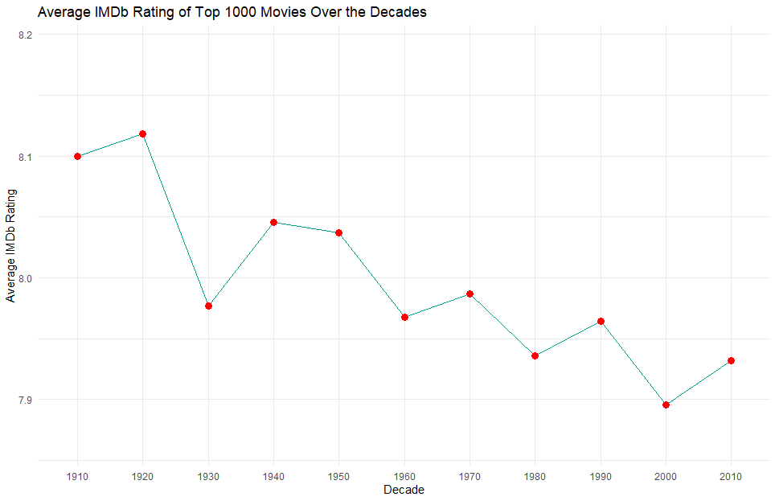

The average IMDb rating of the top 1000 movies peaked in 1930 and has steadily declined in the subsequent decades. This trend may be due to various factors, including changes in audience preferences and evolving cinematic standards. Additionally, the disparity in the number of movies represented in the earlier decades compared to the later ones could also contribute to this trend. 

**Are there certain decades that are more represented?**

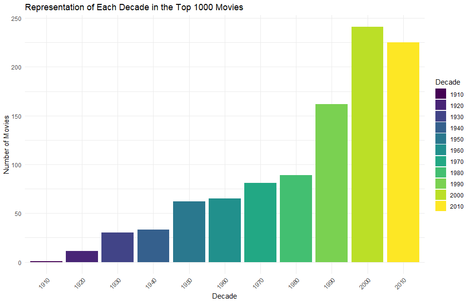

This graph suggests a notable trend where the representation of movies in the top 1000 varies significantly across different decades. The substantial increase in the number of movies from the past two decades compared to earlier ones implies a shift in the composition of top-rated movies over time. This pattern supports the hypothesis presented in the last question, in which more movies could be lowering the overall average of that decade.

**How has the average runtime changed over the years?**

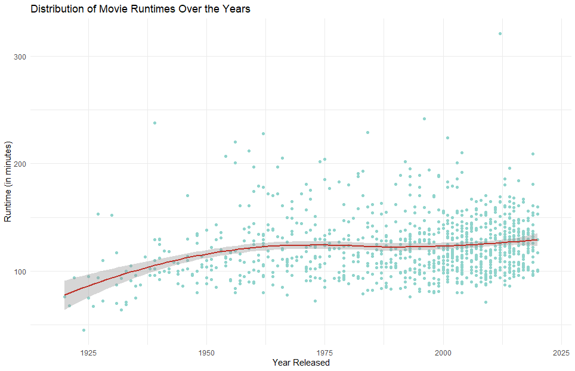

Since the 1960s, the average runtime has consistently hovered around the 2-hour mark, suggesting a preference for movies of moderate duration. However, there appears to be a slight uptick in average runtime in more recent years, indicating a potential shift in audience preferences or filmmaking trends towards longer movies.

### **Genre Analysis**
After getting a better idea of how movies have changed over time, I shifted my focus to explore the diverse genres represented in IMDb's top-rated movies, hoping to uncover the most prevalent genres and any correlations between genre and other factors such as IMDb rating or the age rating the movie received.

**Which genres are most common among top-rated movies?**

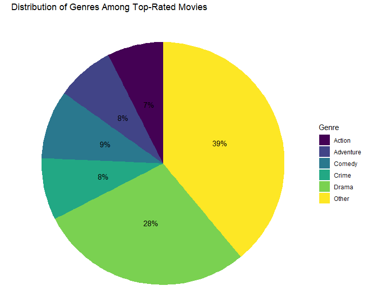

This analysis sheds light on the prevailing genres among IMDb's top-rated movies, with drama emerging as the most common genre, followed by comedy, adventure, crime, and action.

**What is the average rating for each genre?**

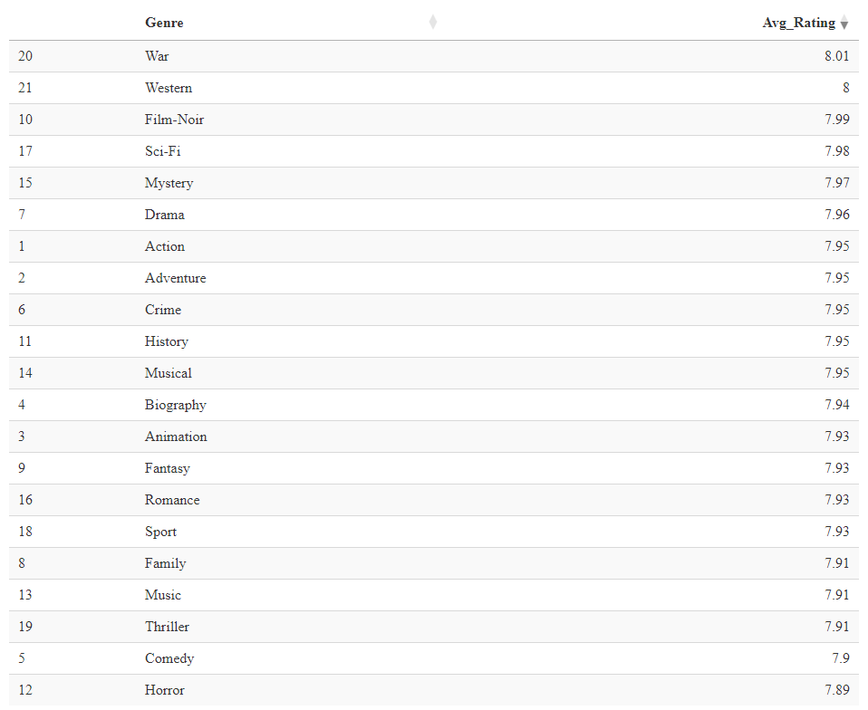

War, western, and film-noir top the list with ratings of 8.01, 8.00, and 7.99, respectively. Conversely, horror, comedy, and thriller genres exhibit lower average ratings, with scores of 7.89, 7.90, and 7.91, respectively. 

**Is there any correlation between a movie’s genre and the age rating it receives?**

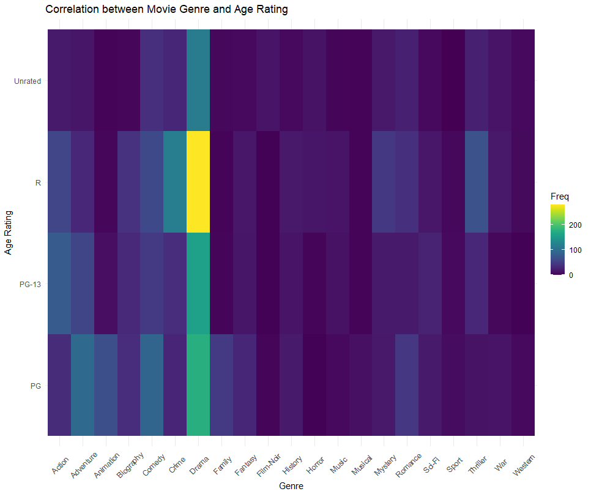

Dramas, which are among the most common genres, are more frequently rated as R, compared to PG or PG-13. Similarly, crime and thriller genres also tend to receive R ratings more often. In contrast, genres like adventure, animation, comedy, family, and romance are predominantly rated as PG. Meanwhile, the action genre is more commonly associated with a PG-13 rating.

### **Director Analysis**
Next, my attention turned toward examining the directors in this dataset. I aimed to identify the directors with the most movies featured and explore any potential correlation between the number of movies a director has in the top 1000 movies and the average rating they attained.

**Who are the top directors in terms of most movies in the top 1000?**

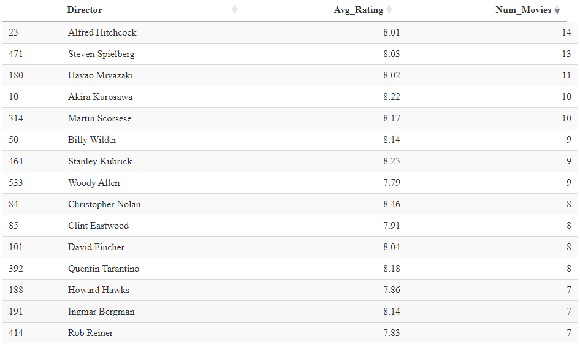

The data reveals that Alfred Hitchcock leads the pack with 14 movies in IMDb's top 1000 list, closely followed by Steven Spielberg with 13. Hayao Miyazaki follows with 11 movies, while Akira Kurosawa and Martin Scorsese share the fourth position with 10 movies each. These directors have made significant contributions to the realm of cinema, earning them multiple spots among the top-rated movies on IMDb.

**Is there a correlation between a director’s average movie rating and the number of movies they’ve directed in the list?**

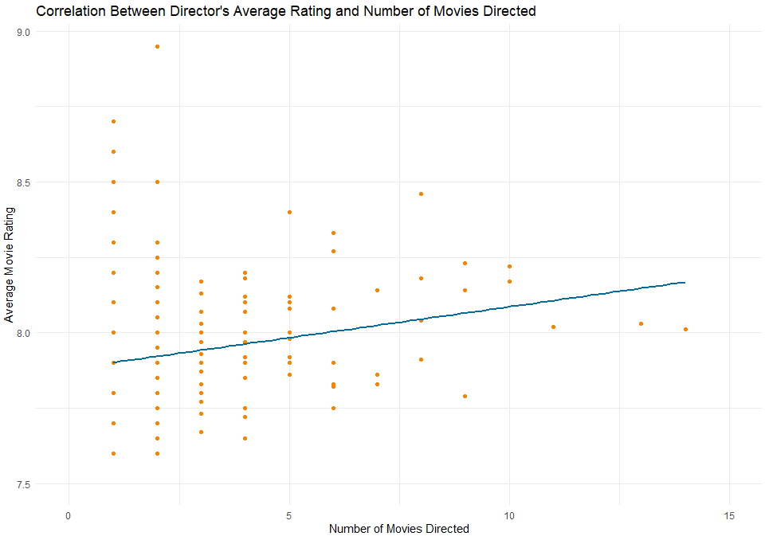

The analysis does not reveal a strong correlation between a director's average movie rating and the number of movies they have directed in the top 1000 list. This observation is supported both visually, through the scatterplot, and quantitatively, by the correlation coefficient. It suggests that the number of movies a director has in the top 1000 list does not necessarily influence the average rating of their movies.

### **Actor Analysis**
Naturally, the spotlight shines on the stars of the movies next. Similar to the directors, I sought to find which actors appear in the most top-rated movies and whether or not the number of movies they star in has an impact on the rating they receive. 

**Which actors appear most frequently in the top-rated movies?**

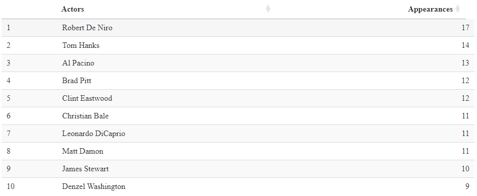

Notable names such as Robert De Niro, Tom Hanks, and Al Pacino featured prominently, with De Niro leading the pack with an impressive 17 appearances. Other prolific actors including Brad Pitt, Clint Eastwood, Christian Bale, Leonardo DiCaprio, and Matt Damon also show up here, each appearing in at least 11 of the top-rated movies.

**How does the number of movies each of the top 10 actors has starred in relate to the average rating of those movies?**

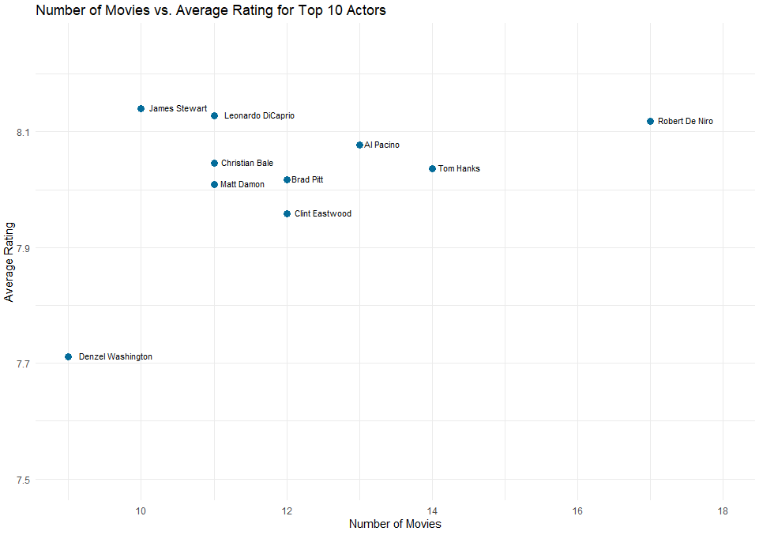

Robert De Niro stood out as a prominent figure, featuring in a substantial number of top-rated movies while maintaining consistently high average ratings. On the other hand, actors like Denzel Washington demonstrated impressive involvement, albeit with slightly lower average ratings compared to those who starred in a higher number of top-rated movies. 

### **Rating & Revenue Analysis**
Next, I wanted to direct my analysis to the gross revenue data. More specifically, how much do most movies make, and whether or not movies make more if they earn a higher IMDb rating.

**How much do most movies make?**

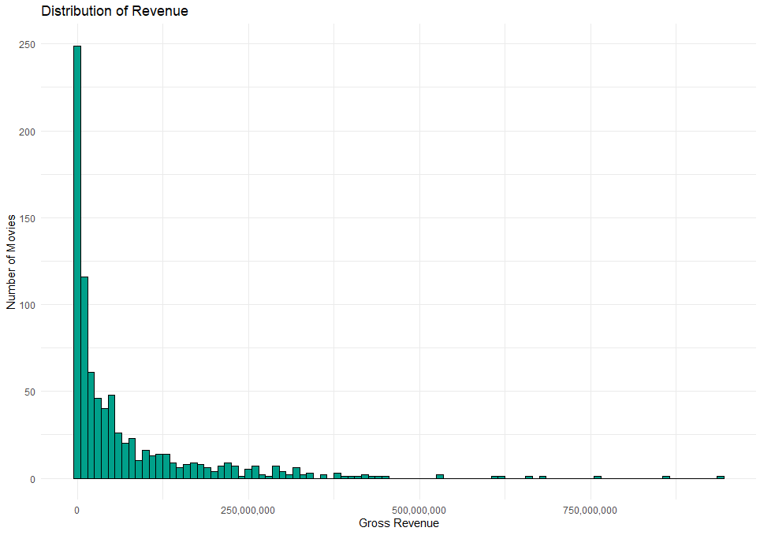

This histogram reveals a notable pattern among IMDb's top-rated movies, with the majority of films earning under $50 million. However, only a small proportion of movies surpass the $250 million mark in revenue, indicating a concentration of blockbuster successes within the dataset.

**Is there a correlation between the IMDb rating and the money a movie earns?**

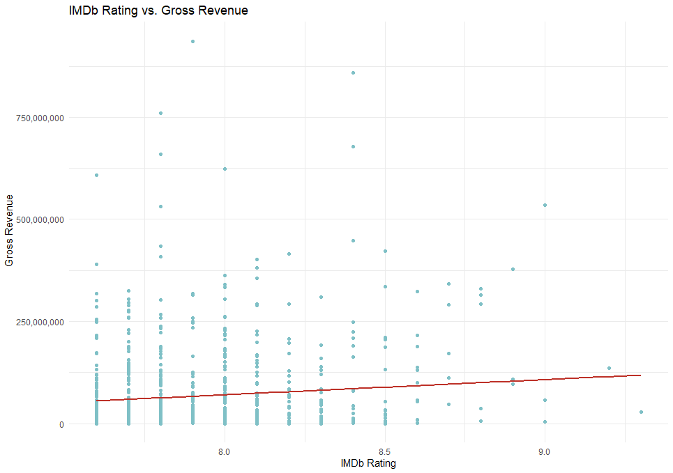

In exploring the correlation between IMDb rating and a movie's revenue, a weak relationship was found. Contrary to expectations, a higher IMDb rating did not consistently translate to higher box office earnings. This finding suggests that while critical acclaim may contribute to a film's success, other factors likely influence its financial performance as well. 

### **Additional Analysis**
Finally, I decided to ask some additional questions that I thought would be interesting to look at. 

**What age rating is most common?**

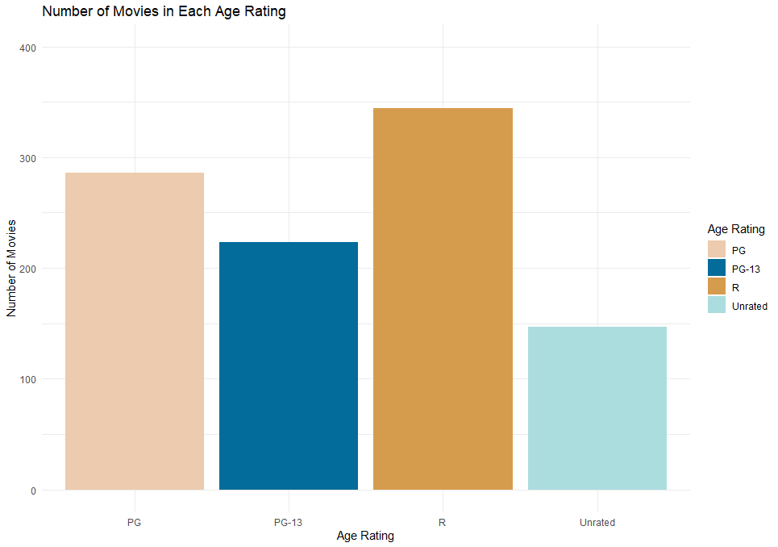
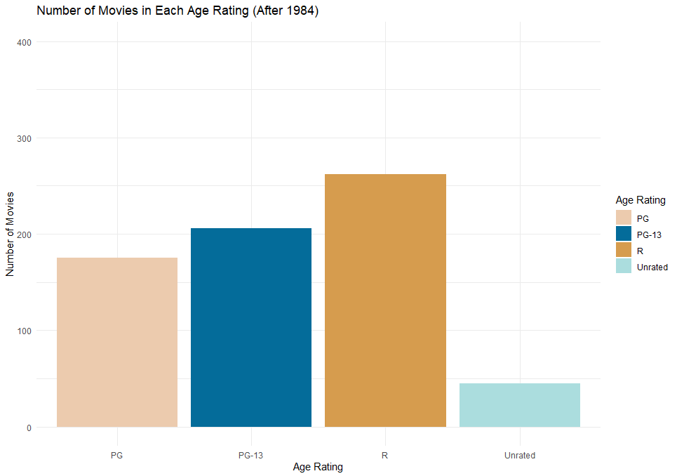

The most common age rating among IMDb's top 1000 rated movies is R, followed by PG and PG-13. It's worth noting that the PG-13 rating wasn't established until 1984, which may have affected its total count compared to other ratings. A subsequent analysis focusing only on movies released after 1984 reaffirms R as the most prevalent age rating, followed by PG-13 and PG, respectively.

**What are some common themes or topics that show up in the top-rated movies?**

The wordcloud of plot overviews reveals several common themes and topics. One prevalent theme is youth and coming-of-age, as indicated by words such as "young", "man", "life", "new", and "world". These words suggest a focus on characters navigating through new experiences and stages of life. Additionally, themes of relationships and personal journeys emerge, with words like "family", "story", "woman", "love", and "war" indicating a focus on interpersonal dynamics, personal narratives, and the complexities of human connections. Lastly, words like "find", "must", "becomes", and "help" suggests themes of struggle, transformation, and the pursuit of goals or resolutions amidst challenges.

## **Visualizations**
To summarize my analysis and findings, I created dashboards in both PowerBI and Tableau with all key visualizations recreated in each respective environment. 
- [PowerBI](https://drive.google.com/file/d/1syroGq6LTWBoNKg6IzsU71Vxejp4n8et/view?usp=drive_link)
- [Tableau](https://public.tableau.com/app/profile/brianwei/viz/IMDbMoviesDashboard_17072657280140/Overview)

## **Conclusion**
Through temporal analysis, I found shifting patterns in movie ratings and representation across different decades, shedding light on evolving cinematic trends over time. Analyzing the different genres revealed the dominance of drama, along with intriguing correlations between genre and age ratings. Director and actor analyses showcased the influential figures shaping the landscape of top-rated movies, while looking into ratings and revenue highlighted the nuanced relationship between critical acclaim and box office success.

As I navigated through the data, it became increasingly clear that IMDb ratings, while informative, only scratch the surface of a movie's significance. Beyond mere numbers, a film's impact can be defined by its storytelling prowess, artistic vision, and the simple joy of immersing oneself in a good movie. 
